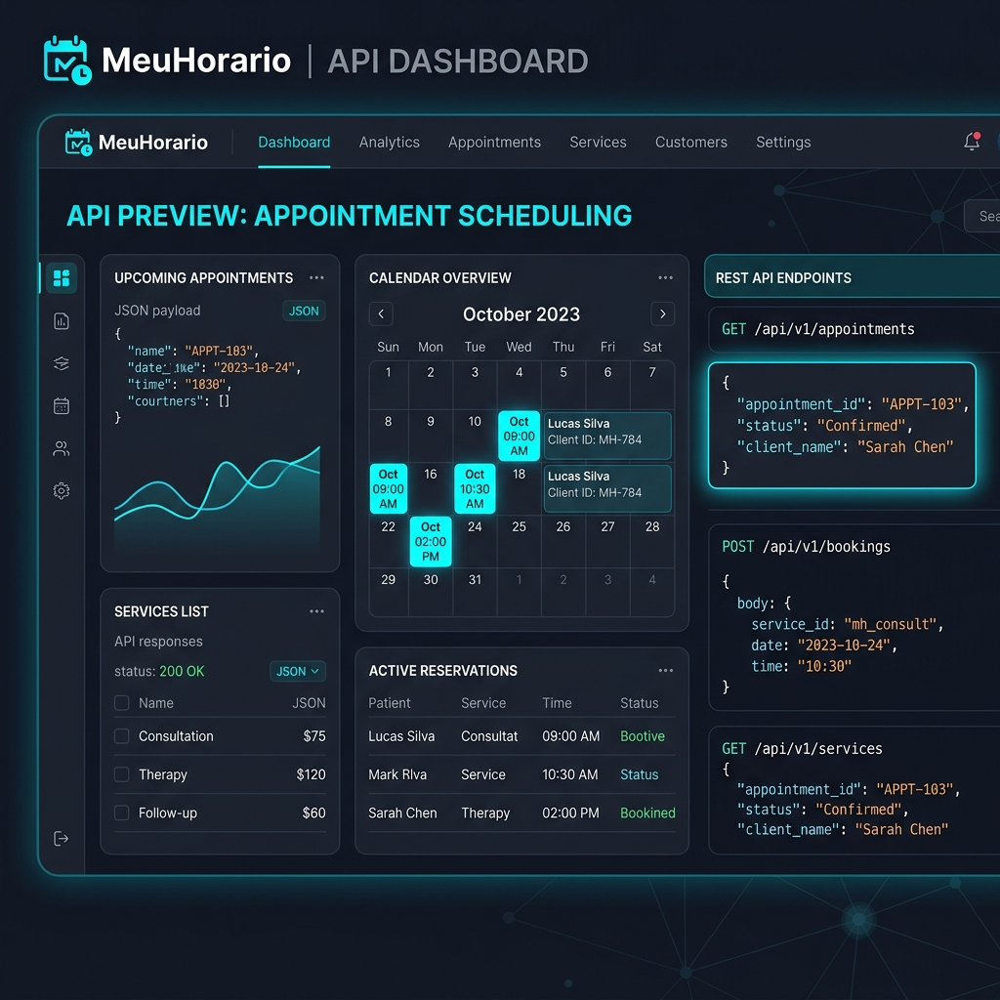

# 🚀 Matheus Filipe — Personal Portfolio

Portfólio pessoal com temática de desenvolvimento **Backend em Python**, projetado para ser hospedado no **GitHub Pages**.



## 📌 Sobre o Perfil

- 🎓 **Formação**: Cursando Ciência da Computação na UTFPR
- 🐍 **Linguagem Principal**: Python
- ⚡ **Área**: Desenvolvedor Backend Júnior (em formação)
- 🗣️ **Idioma**: Inglês Fluente
- 🏆 **Algoritmos**: [Codewars Profile](https://www.codewars.com/users/MatheusFilipe)

---

## 🛠️ Tecnologias & Competências

### Competências Consolidadas:
- **APIs REST & Serviços**: Desenvolvimento completo de APIs REST (rotas, upload de arquivos, integração com JSON e CSV).
- **Programação Orientada a Objetos (POO)**: Modelagem de dados, estrutura de classes e boas práticas de código limpo.
- **Bancos de Dados & SQLAlchemy**: Modelagem de entidades, ORM e operações de banco de dados (CRUD).
- **Versionamento & Testes**: Git/GitHub, escrita de testes automatizados e entregas completas de backend.

### Atualmente Aprofundando:
- **SQL** avançado
- **Ecossistema Python Moderno** (`typing`, `decorators`, `generators`, `context managers`)
- **Arquitetura de Software**
- **Docker**, **CI/CD** e **Linux**
- **Concorrência Assíncrona** (`AsyncIO`)

---

## 📁 Projetos no Portfólio

- **MeuHorário** ([Repositório](https://github.com/MatheusFilipe/MeuHorario)): API REST para cadastro de clientes, serviços, horários disponíveis, marcação e cancelamento de agendamentos.
- **FlowOps** ([Repositório](https://github.com/MatheusFilipe/FlowOps)): Sistema capaz de automatizar operações administrativas e operacionais de pequenos negócios locais.

---

## 💻 Como Publicar no GitHub Pages

Para publicar ou atualizar seu portfólio no GitHub Pages (`https://MatheusFilipe.github.io` ou `https://MatheusFilipe.github.io/portfolio`):

1. **Faça Commit e Push do código**:
   ```bash
   git add .
   git commit -m "feat: refine portfolio focus, skills presentation and project FlowOps"
   git push origin main
   ```

2. **Ative o GitHub Pages**:
   - Vá no repositório no GitHub: `https://github.com/MatheusFilipe/portfolio`
   - Acesse **Settings** > **Pages**.
   - Em **Source**, selecione a branch `main` e a pasta `/ (root)`.
   - Clique em **Save**.

---

## 📬 Contato

- **E-mail**: `matheus.filipes.rodrigues@gmail.com`
- **GitHub**: [github.com/MatheusFilipe](https://github.com/MatheusFilipe)
- **LinkedIn**: [linkedin.com/in/matheusfiliperod](https://www.linkedin.com/in/matheusfiliperod/)
- **Codewars**: [codewars.com/users/MatheusFilipe](https://www.codewars.com/users/MatheusFilipe)
